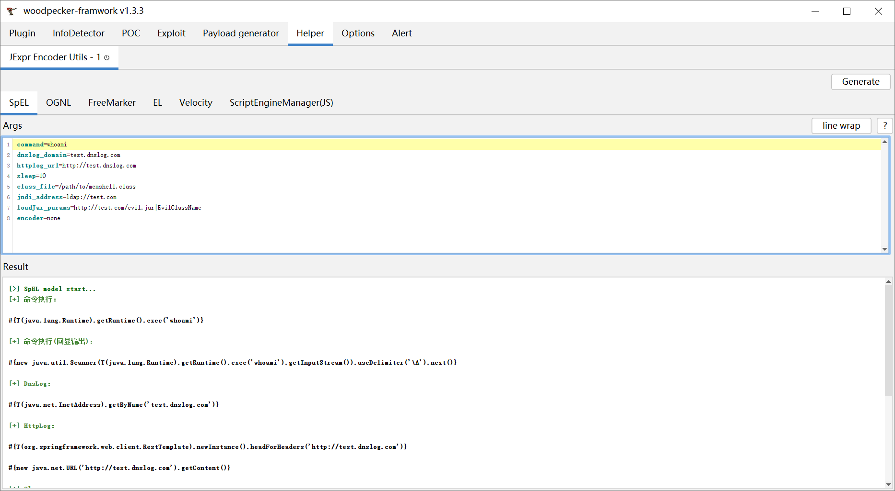

# jexpr-encoder-utils

  
  
  

Java表达式语句生成器。

简体中文 | [English](README_en.md)

---

## 0x01 简介
`jexpr-encoder-utils`是一款在[woodpecker框架](https://github.com/woodpecker-framework/woodpecker-framwork-release/releases)中用于生成各种Java语言表达式语句的插件。

## 0x02 已支持的语句类型

| 表达式名称                   | 命令执行 | 回显命令执行 | DNSLog | HTTPLog | Sleep | MemShell Inject | JNDI | Load Jar |
|-------------------------|------|--------|--------|---------|-------|-----------------|------|----------|
| SpEL                    | √    | √      | √      | √       | √     | √               | √    | x        |
| OGNL                    | √    | √      | √      | √       | √     | √               | √    | x        |
| FreeMarker              | √    | √      | √      | √       | √     | √               | √    | x        |
| EL                      | √    | √      | √      | √       | √     | √               | √    | x        |
| Velocity                | √    | √      | √      | √       | √     | √               | x    | x        |
| ScriptEngineManager(JS) | √    | √      | √      | √       | √     | √               | √    | √        |

## 0x03 示例界面

## 0x04 贡献者

[whwlsfb](https://github.com/whwlsfb/)@SgLab

